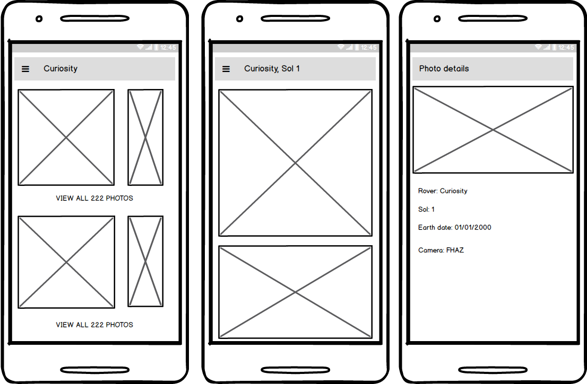

# Mars Explorer

## Getting Started

Mars Explorer is an app to view photos from NASA's rovers, which utilizes NASA's Open Api [link](https://api.nasa.gov/), see "Mars Rover Photos"

The app consists of three screens: A Main screen with a list of Rover Sols and small list of thumbnails. Photos list screens, which shows all photos for the rover and Sol. The third screen is photo details. 

This project is my final project for ND-940

### Design



### Milestones


### Rubric checklist


### Installation

To get the project running on your local machine, you need to follow these steps:

**Step 1: Clone the repo**

Use this to clone it to your local machine:
```bash
git clone https://github.com/artem-benda/nd940-final-project.git
```

**Step 2: Check out the master branch**

This branch is going to let you start working with it. The command to check out a branch would be:

```bash
git checkout master
```
**Step 3: Obtain you key for the API and replace DEMO_KEY in app/build.gradle**

Open [https://api.nasa.gov/](https://api.nasa.gov/) and fill the form "Generate API Key". Replace the DEMO_KEY key in app/build.gradle with newly obtained key. 

**Step 4: Run the project and check that it compiles correctly**

Open the project in Android Studio and click the Run app button, check that it runs correctly and you can see the app in your device or emulator.

